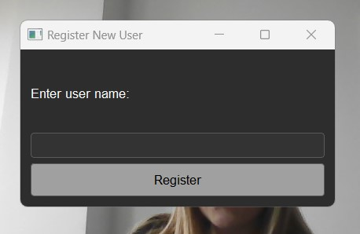

# Sistem za prepoznavanje korisnika

Ovaj kod definiše jednostavnu PyQt5 aplikaciju dizajniranu kao Sistem za prepoznavanje korisnika, koristeći face_recognition biblioteku za autentifikaciju i registraciju korisnika. Evo brzog pregleda glavnih funkcionalnosti:

- **Inicijalizacija i podešavanje UI**: Aplikacija postavlja glavni prozor sa naslovom, određenom geometrijom i stilovima koristeći klasu App koja je izvedena iz QMainWindow. UI uključuje oznaku za prikazivanje video zapisa sa web kamere, dugmad za prijavu i registraciju, te oznaku za prikazivanje poruka dobrodošlice ili statusa prijave.

- **Rukovanje video zapisom sa web kamere**: Koristi OpenCV (cv2) za hvatanje video zapisa sa web kamere i ažurira feed u realnom vremenu na UI. QTimer je postavljen da osvežava video zapis sa web kamere unutar prozora aplikacije.

- **Prepoznavanje lica za prijavu**: Funkcija za prijavu hvata trenutni frejm sa web kamere, privremeno ga sačuva i koristi biblioteke face_recognition i subprocess da proveri da li se lice na uhvaćenoj slici poklapa sa bilo kojim licima skladištenim u bazi podataka. Ako se pronađe poklapanje, događaj se beleži sa imenom korisnika i trenutnim datumom i vremenom. Ako se poklapanje ne pronađe, prikazuje se poruka o neuspešnoj prijavi.

- **Registracija korisnika**: Pruža funkcionalnost za registraciju novog korisnika hvatanjem frejma sa web kamere kao identifikacione slike korisnika. Ova slika i njeno kodiranje (generisano pomoću face_recognition) se čuvaju u određenom direktorijumu baze podataka, omogućavajući sistemu da prepozna korisnika u budućim pokušajima prijave.

- **Skladištenje podataka**: Kodiranja korisnika se čuvaju u .pickle datotekama unutar direktorijuma baze podataka (db), a događaji prijave se beleže u tekstualnoj datoteci (log.txt).

Aplikacija je primer integracije prepoznavanja lica sa PyQt5 GUI-om za kreiranje korisnički prijateljskog sistema za prepoznavanje korisnika.

