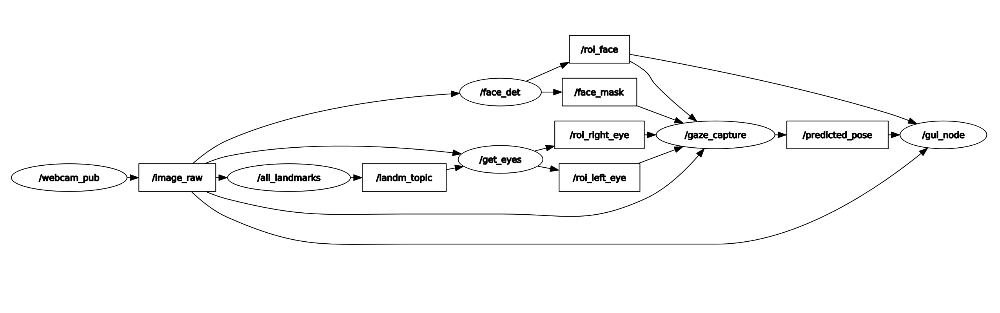

# ROS2 u Kompjuterskoj viziji

## Uvod
Kod omogućava modularni pristup gde svaki čvor rukuje određenim delom procesa praćenja pogleda, od hvatanja sirove slike do detekcije karakterističnih tačaka, ekstrakcije regiona očiju, predviđanja pogleda, i konačno, prikazivanja ove informacije. Ilustruje moć ROS2 u rukovanju složenim sistemima u realnom vremenu distribuiranjem zadataka preko višestrukih čvorova koji komuniciraju preko tema. Takodje su implementirani drowsiness detection i user recognition.

## Namestanje okruzenja

Uputstvo instalacije ROS2 moze se pronaci u ros2_basics folderu ovog repozitorijuma.

Napraviti folder u kom ce se nalaziti projekat.
```python
mkdir ros2_ws
cd ros2_ws
mkdir src
colcon build
cd src
ros2 pkg create system --build-type ament_python --dependencies rclpy
```
Kada su svi fajlovi generisani, kopirati sadrzaj iz ovog repozitorijuma:

- ros2_ws/launch;
- ros2_ws/src/custom_interfaces;
- ros2_ws/src/system/system;
- ispraviti generisane package.xml i setup.py, tako da izgledaju kao prilozeni u repozitorijumu.

```python
cd ros2_ws
colcon build --symlink-install
```

## Pokretanje koda

Kako bi se pokrenuli svi node-ovi, a zatim i interaktivni prozor, pratiti ove korake.
```python
cd ros2_ws
colcon build --symlink-install

cd launch
ros2 launch launch_file.py

# u novom terminalu:
cd ros2_ws/src/system/system
python3 gui.py
```
## Nodes and topics
<div align="center">

</div>

**/webcam_pub**
Ovo je čvor koji hvata sirove slike iz web kamere i objavljuje ih na temu /image_raw.

**/image_raw**
Tema na kojoj se objavljuju frame-ovi iz web kamere. Ostali čvorovi se pretplaćuju na ovu temu kako bi primili sirove podatke slike za dalju obradu.

**/all_landmarks**
Čvor koji se subscribe-uje na /image_raw i zadužen je za detekciju i publish-ovanje svih relevantnih karakterističnih tačaka lica (landmarks). Podaci se objavljuju na temu /landm_topic.

**/landm_topic**
Tema gde se objavljuju karakteristične tačke lica. Čvorovi koji izvršavaju specifične zadatke na osnovu ovih tačaka će se subscribe-ovati na ovu temu.

**/face_det**
Čvor subscribe-ovan na /image_raw, posvećen detekciji lica. Detektuje lice unutar slike i može objaviti region interesa (ROI) ili masku lica na temu /face_mask.

**/face_mask**
Tema nosi informacije o detektovanom licu, uključujući koordinate ili masku lica unutar slike.

**/get_eyes**
Čvor koji se takođe subscribe-uje na /landm_topic i odgovoran je za izdvajanje regiona očiju iz slike. Objavljuje regione interesa za desno i levo oko na temama /roi_right_eye i /roi_left_eye.

**/roi_right_eye** i **/roi_left_eye**
Teme nose regione interesa za desno i levo oko, koji su ključni za praćenje pogleda.

**/gaze_capture**
Čvor pretplaćen na /roi_right_eye, /roi_left_eye i moguće /landm_topic. Verovatno je zadužen za analizu regiona očiju i karakterističnih tačaka kako bi se odredio pravac pogleda. Rezultat ove analize se objavljuje na temu /predicted_pose.

**/predicted_pose**
Tema nosi informacije o predviđenom pravcu pogleda, koji je izveden iz analize regiona očiju i karakterističnih tačaka lica.

**/gui_node**
Čvor koji se subscribe-uje na /predicted_pose /image_raw i /roi_face. Odgovoran je za pružanje korisničkog interfejsa koji prikazuje rezultate praćenja pogleda, kao što je vizualizacija gde korisnik gleda ili drugi interaktivni elementi zasnovani na korisnikovom pogledu.
Takodje pomocu informacija o licu prati prisustvo osobe i omogucava njenu identifikaciju.
