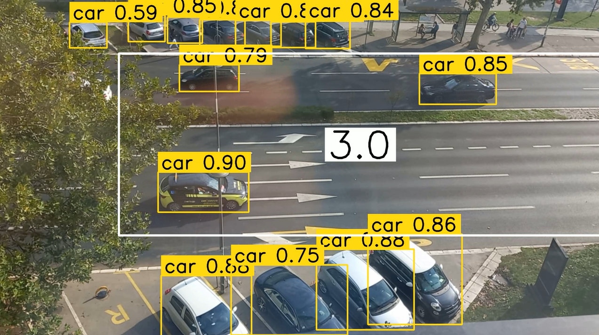

# Upoznavanje YOLO from ULTRALYTICS

## Uvod

U ovom direktorijumu se nalazi nekoliko fajlova koji obuhvataju implementaciju modela YOLO, koji se koristi kao detektor objekata. Ovaj model je često primenjivan za prepoznavanje objekata u kontekstu saobraćaja, uključujući automobile, kamione, motocikle, bicikle i pešake. Osim toga, vredno je napomenuti da ovaj model ima sposobnost prepoznavanja različitih predmeta u širem spektru svakodnevnog života.

---

## Requirements

- python<=3.11
- ultralytics==8.0.186
- supervision==0.14.0
- opencv-python==4.8.1.78
- numpy==1.24.3

---

Za korišćenje modela sa web kamerom samo za detekciju:

```python
yolo detect predict [model=yolov8l.pt](http://model%3Dyolov8l.pt/) source=0 show=true
```

---

## object_detect

Skripta koja radi isto što i pozivanje linije iznad, ali unutar koda, tako da je moguće napraviti specifikacije za konkretnu upotrebu. Na primer, ispisivanje FPS, ograničenje zone detekcije, ograničenje rezolucije kamere, podešavanja anotacija i verovatnoća detekcije objekta...

---

## videoinfo.py

Skripta koja se koristi za obradu video zapisa koristeći YOLOv8 model za detekciju objekata, anotiranje i praćenje tih objekata u određenoj oblasti kadra. Potrebno je podesiti lokacije videa i njegove obrade unutar koda. Ja sam snimila saobraćaj na Bulevaru Oslobođenja sa prozora kancelarije. Poligon (oblast detekcije) je prilagođen ovom videu tako da se ne broje vozila na parkingu, već samo automobili koji su u raskrsnici. Taj broj je zatim ispisan u centru poligona.


---

## rt_count.py

Isto kao videoinfo.py, ali u realnom vremenu, tačnije prima informacije direktno sa web kamere umesto da čita video.
